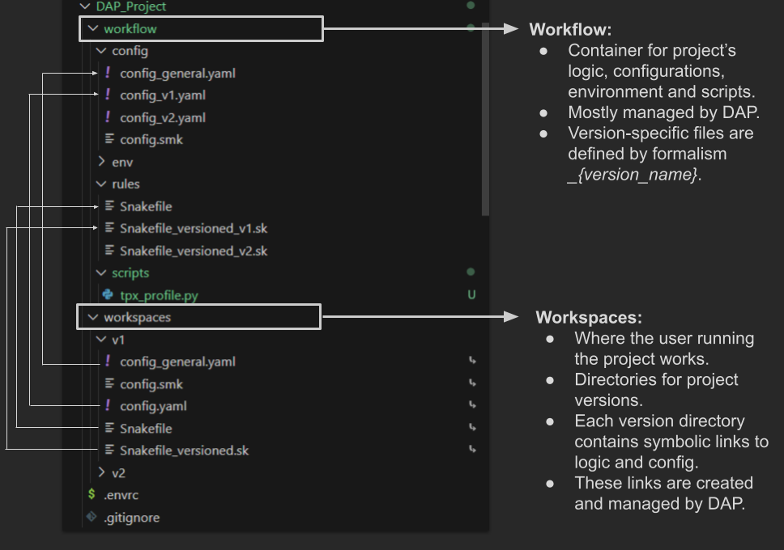

      _______    ______   _______  
      |       \  /      \ |       \ 
      | ▒▒▒▒▒▒▒\|  ▒▒▒▒▒▒\| ▒▒▒▒▒▒▒\
      | ▒▒  | ▒▒| ▒▒__| ▒▒| ▒▒__/ ▒▒      
      | ▒▒  | ▒▒| ▒▒    ▒▒| ▒▒    ▒▒
      | ▒▒  | ▒▒| ▒▒▒▒▒▒▒▒| ▒▒▒▒▒▒▒ 
      | ▒▒__/ ▒▒| ▒▒  | ▒▒| ▒▒      
      | ▒▒    ▒▒| ▒▒  | ▒▒| ▒▒      
       \▒▒▒▒▒▒▒  \▒▒   \▒▒ \▒▒      
       
      Data Analysis Project Management
      _____________________________________

DAP is a project management tool, suited for bioinformatics or data anaysis project in general, with a focus on Snakemake workflows.

DAP encapsulates some conventions on how to organize Snakemake projects and offers as set of tools to manage them.

DAP conventions aim to:
* **Facilitate project versioning**
   * Creation, editing of versions, isolation of version-specific logic and configuration.
* Push toward **sustainable use of conda environments**.
   * one project <--> one conda environment
   * environment stored locally inside the project tree.
   * environment automatically activated upon user entering the project directory.

# Usage
## Installation

Linux and Mac OSX are supported.

### Install dap with conda

Dap can be installed from Anaconda: https://anaconda.org/molinerislab/dap with the following command

```
conda install -c molinerislab dap
```

we advise to install it in the `base` environment or in a specific one. This environment will be needed to create new projects.

## Create a new project
`dap create` creates a new project in the current working directory. It creates:
* A project directory structure.
* A set of templates Snakefiles and config files.
* A local *conda* environment.
* A git repository.

```dap create [--source_env=MyEnv.yaml] [--remote-git-repo=https://..] ProjectName ProjectVersion```

* **ProjectName**: the name of the project, which will correspond to the directory and the git repository created.
* **ProjectVersion**: initial version of the project.
* **[--source_env=MyEnvironment]**: optional, yaml file of an existing conda environment. The environment will be cloned. If not specified, a new, empty project environment will be created.
* **[--remote-git-repo=https://..]**: optional, the project repository is connected to the remote repository.


## Work inside a project
Once the project is created with `dap create`, *direnv* is used to automatically set up the workspace context upon user entering the project directory.
* Upon first entering the project directory, the user needs to authorize direnv with `direnv allow`.
* Once *direnv* is allowed, every time the user enters the project:
   * **PRJ_ROOT** will point to the root of the project.
   * **The system PATH** will include *PRJ_ROOT/workflow/scripts*.
   * The project *conda* environment is activated.


## Create new version
`dap clone` creates a new project's version by cloning an existing one. It needs to be executed inside the project directory.

`dap clone [--link-All-Data] SourceVersion NewVersion`
* SourceVersion: Name of the version to be cloned.
* NewVersion: Name of the new version.
* [--link-All-Data]: If enabled, copy links to files outside of the project as well - es. links to datasets.

The command creates a new directory  *worspaces/{NewVersion}*. Here, for each link inside *worspaces/{OldVersion}*:
* If the link refers to a non-version specific file: the link is copied, the original file is not changed.
* If the link refers to a version specific file: the version-specific file is copied, with updated name, and a link to the new file is created.
**By convention, version specific files' names end with _{VersionName}.**


### Dap clone and sub-versions
SourceVersion and NewVersion might refer to subfolders inside the dataset/ directory, using the common '/' syntax. For example it's possible to have a version named *humans/v1*. In this case the following operations are allowed:
* dap clone humans/v1 humans/v2 --> simply clones the humans/v1 version into humans/v2.
* dap clone humans/v1 bald_monkeys/v1 --> clones the humans/v1 version into bald_monkeys/v1. If bald_monkey directory does not exist, it creates it.
* dap clone humans bald_monkeys --> clones the entire humans directory into the new directory. Any version inside the human directory will be cloned.
These operations are not allowed:
* dap clone humans humans/v3 --> cannot clone entire directory into a subdirectory of it.
* dap clone humans/v1 humans --> cannot clone directory into parent (or ancestor) directory.


## The DAP tree
The directory structure of a DAP project is made of two main components in its root:
* The **Workflow** directory, containing the entire project's logic and configuration, both global and version-specific.
   * The Workflow directory is **not** where the user stores the input files, results and it's not where the user works.
* The **Workspaces** directory is where versions are kept and where the user running the workflow works. 



The **workflow** directory has sub-directories for the configuration files, environment, rules and scripts.

The **workspaces** directory has sub-directories for all the versions created. Inside each version:
* **Snakefile** is a symbolic link to *workflows/rules/Snakefile*
* **Snakefile_versioned.sk**  is a symbolic link to *workflows/rules/Snakefile_versioned_{VERSION_NAME}*
* **config_global.yaml** is a symbolic link to *workflows/config/config_global.yaml*
* **config.yaml** is a symbolic link to *workflows/config/config_{VERSION_NAME}.yaml*.


Basically, for rules and configuration, the user finds both global and version-specific files inside its version's directory. These files are links to files stored in the **workflow** directory, and the original files are managed by DAP.

Version-specific rules and configurations always override global ones.

### Convert from old dap projects
The directory structure of DAP has been updated, renaming some directories.
In order to work with previous projects, a command `dap convert` is offered. This command updates the directory structure and symbolic links inside the project.


